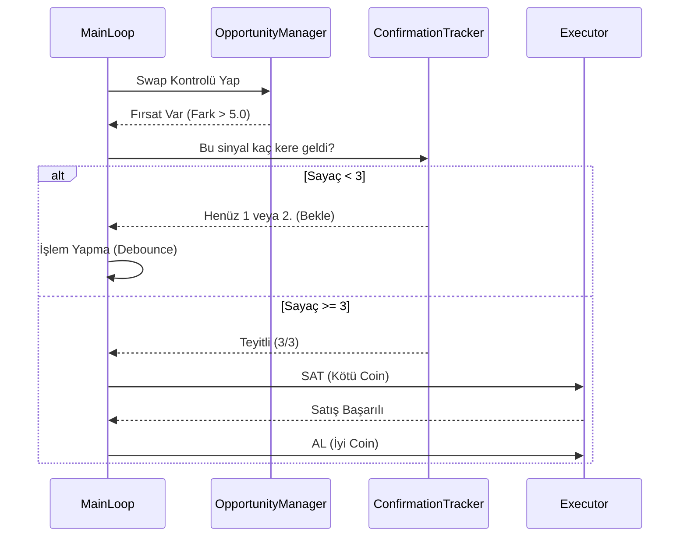

# Proje Algoritma ve Mimari Dokümantasyonu (v2.8 - Professional Standards)

Bu doküman, Kripto Bot projesinin en güncel (v2.8) teknik mimarisini, algoritma detaylarını ve kod yapısını **en ince ayrıntısına kadar** açıklamaktadır.

---

## 1. Sistem Mimarisi (System Architecture)

Sistem, **Modüler Ajan Mimarisi (Modular Agent Architecture)** üzerine kuruludur. Her bir modül (Ajan), belirli bir sorumluluk alanına sahiptir ve merkezi bir "Main Loop" tarafından koordine edilir.

### Mimari Şema (Mermaid Diagram)

```mermaid
graph TD
%% Veri Katmanı
subgraph Data_Layer [Veri Katmanı]
    DL1[Binance Global API (CCXT)] -->|OHLCV & Ticker| AL1
    DL2[Funding Rate Loader] -->|8h Rates| AL3
    DL3[Sentiment Analyzer] -->|Futures L/S Ratio| AL2
    DL4[Wallet Manager] -->|Balance & Positions| EXEC
end

%% Analiz Katmanı
subgraph Analysis_Layer [Analiz Katmanı]
    AL1[Market Analyzer]
    AL2[Sentiment Score]
    AL3[Funding Strategy]
    AL4[Volume Profile & OrderBook]
    AL5[Market Regime Detector]
    AL6[ML Ensemble Model]
    
    AL1 -->|Technical Signals| DL_DECISION
    AL6 -->|Prob Score| DL_DECISION
    AL2 -->|Sentiment Boost| DL_DECISION
    AL3 -->|Long/Short Block| DL_DECISION
    AL4 -->|Support/Resistance| DL_DECISION
    AL5 -->|Trend/Range| DL_DECISION
end

%% Karar Katmanı (Decision Engine)
subgraph Decision_Engine [Karar Motoru (TradeManager)]
    DL_DECISION{TradeSignal Generator}
    
    DL_DECISION -->|Score Calculation| SCORE[Skor Hesaplama]
    SCORE -->|Base Score| STRAT[Strateji Ağırlıkları]
    STRAT -->|Final Score| FILTERS[Filtreler]
    
    FILTERS -->|Is Safe?| RISK[Risk & Safety Check]
    RISK -->|Approved| TM[TradeManager Orchestrator]
    TM -->|Sniper Mode Logic| SNIPER[Sniper Handler]
    SNIPER -->|Low Balance?| OPP[Opportunity Manager]
    OPP -->|Swap Needed?| CONFIRM[3-Loop Confirmation]
    CONFIRM -->|Approved| TM
end

%% Öğrenme Katmanı (Learning Layer)
subgraph Learning_Layer [Öğrenme Katmanı (Brain)]
    TM -->|Trade Result (PnL)| BRAIN[BotBrain]
    BRAIN -->|Update Weights| STRAT
    BRAIN -->|Ghost Trades| GHOST[Sanal Takip]
    BRAIN -->|Performance Regime| RISK
end

%% Yürütme Katmanı (Execution)
subgraph Execution_Layer [Yürütme Katmanı]
    TM -->|Execute Strategy| EXEC[Executor]
    EXEC -->|Order| BINANCE[Binance Exchange]
    EXEC -->|Sync| WALLET
    WALLET -->|Dust| DUST[Dust Converter]
end

Data_Layer --> Analysis_Layer
Analysis_Layer --> Decision_Engine
Decision_Engine --> Execution_Layer
Execution_Layer --> Learning_Layer
```

---

## 2. Temel Veri Modelleri (Core Data Models)

Sistemin kalbinde, modüller arası veri taşıyan standartlaştırılmış sınıflar bulunur.

### 2.1. TradeSignal (Sinyal Paketi)
`src/strategies/analyzer.py` içinde tanımlıdır. Analiz katmanının çıktısıdır.

```python
class TradeSignal(BaseModel):
    symbol: str
    action: str            # "ENTRY", "EXIT", "HOLD"
    direction: str         # "LONG" (Spot için)
    score: float           # -20.0 ile +40.0 arası puan
    estimated_yield: float # Tahmini getiri (Opsiyonel)
    timestamp: int         # Sinyal üretim zamanı (Unix Epoch)
    details: Dict          # İndikatör değerleri (RSI, MACD vb.)
    primary_strategy: Optional[str] = None # "high_score_override" vb.
```

### 2.2. Market Regime (Piyasa Rejimi)
İki farklı rejim analizi yapılır:
1.  **Teknik Rejim (`src/analysis/market_regime.py`):** Fiyat hareketine dayalı (TRENDING, RANGING).
2.  **Performans Rejimi (`src/learning/brain.py`):** Botun başarısına dayalı (BULL, BEAR, CRASH).

---

## 3. Algoritma Detayları ve Kod Akışı

Botun "Main Loop" (`src/main.py`) içindeki her bir döngüsü şu adımları izler:

### Adım 1: Piyasa Rejimi Tespiti (Market Regime Detection)
Her döngü başında BTC verisi analiz edilir.

```python
# src/analysis/market_regime.py
def detect_regime(self, df: pd.DataFrame) -> Dict[str, Any]:
    # Bollinger Band Genişliği (Volatilite Göstergesi)
    curr_bb_width = (curr['BB_Upper'] - curr['BB_Lower']) / curr['BB_Middle']
    bb_widening = curr_bb_width > prev_bb_width
    
    # ADX (Trend Gücü)
    adx = curr.get('ADX', 0)
    
    if adx > 25 and bb_widening:
        return "TRENDING"
    elif adx < 20 and bb_narrow:
        return "RANGING"
    else:
        return "NEUTRAL"
```

### Adım 2: Sinyal Üretimi ve Puanlama (Scoring System)
Her coin için `analyze_spot` fonksiyonu çalışır. Puanlama **Ağırlıklı Oylama (Weighted Voting)** sistemiyle yapılır.

**Skor Tablosu (Base Score):**

| İndikatör | Koşul | Puan Etkisi | Mantık |
| :--- | :--- | :--- | :--- |
| **RSI** | < 30 (Oversold) | +2.0 | Tepki alımı ihtimali. |
| **RSI** | > 70 (Overbought) | -2.0 | Düşüş riski. |
| **Golden Cross** | SMA7 > SMA25 | +3.0 | Kısa vadeli yükseliş trendi. |
| **Death Cross** | SMA7 < SMA25 | -3.0 | Düşüş trendi. |
| **SuperTrend** | Yeşil (Al) | +2.0 | Trend takibi. |
| **MACD** | Al Sinyali | +1.5 | Momentum artışı. |
| **Bollinger** | Alt Band Teması | +2.0 | Destekten dönüş. |
| **Volume** | Vol > 1.5x Ort. | +1.0 | Hacimli hareket onayı. |
| **Sentiment** | L/S Ratio > 1.2 | +1.5 | Vadeli piyasa beklentisi pozitif. |
| **ML Score** | Prob > 0.6 | ±2.0 | Random Forest Model Tahmini. |

**Öğrenen Ağırlıklar (BotBrain):**
Her indikatörün etkisi, botun geçmiş performansına göre dinamik olarak değişir.
```python
# src/learning/brain.py
def update_indicator_weights(self, indicator_signals, pnl_pct):
    lr = 0.02 # Öğrenme hızı
    if is_win:
        # Kazandıran indikatörün ağırlığını artır
        weights[ind] *= (1 + lr)
    else:
        # Kaybettirenin ağırlığını azalt
        weights[ind] *= (1 - lr)
```

### Adım 3: Karar Motoru (TradeManager)

Sinyaller toplandıktan sonra `TradeManager` sınıfı tüm akışı yönetir. Bu modül, sinyalleri filtreler, risk kontrollerini yapar ve uygun stratejiyi (Sniper veya Normal) seçer.

#### A. Sniper Mode (Düşük Bakiye / All-In)
Eğer bakiye az ise ve portföy doluysa, bot **en iyi fırsata** geçmek için "Swap" (Takas) arar.

**5 Puan Kuralı ve 3-Loop Teyit Mekanizması:**
Botun sürekli al-sat yapıp komisyon eritmesini (Churning) önlemek için katı kurallar vardır. Bu mantık `TradeManager.handle_sniper_mode` içinde yürütülür.

```python
# src/execution/trade_manager.py

async def handle_sniper_mode(self, all_market_signals, current_prices_map):
    # ...
    score_diff = best_signal.score - worst_position_score
    
    if score_diff >= 5.0:
        # 3-Loop Confirmation (Debounce)
        self.swap_confirmation_tracker[symbol] += 1
        if self.swap_confirmation_tracker[symbol] >= 3:
             # EXECUTE SWAP
             await self.executor.execute_strategy(sell_signal)
             await self.executor.execute_strategy(buy_signal)
```



##### 3.1.1. Süper Sinyal Hızlı Yol (Fast Path) – Güvenli
- Koşul: En iyi sinyal skoru ≥32 (ZAMA/USDT için ≥31) ve eldeki varlığa göre skor farkı ≥20.
- Aksiyon: Mevcut pozisyon derhal satılır, ardından 5 sn beklenir ve cüzdan bakiyesi senkronize edilir.
- Yeniden Doğrulama: Alımdan hemen önce sinyal skoru eşik üzerinde mi ve fiyat kayması (slippage) ≤%1 mi kontrol edilir; şartlar bozulduysa alım iptal edilir.
- Korelasyon: Süper sinyallerde korelasyon filtresi bypass edilir; diğerlerinde korelasyon >0.85 ise atlanır.

##### 3.1.2. Kilit Kırma (Hold-Time Lock Override)
- Koşul: Skor farkı ≥20 olduğunda, “kilitli varlık/hold-time” engeli tüm modlarda aşılır.
- Amaç: Çok yüksek fırsat farklarında bekleme nedeniyle fırsat kaçırmayı engellemek.

##### 3.1.3. Adaptif Sniper Eşiği
- Volatilite düşükse gerekli skor farkı 3.5’e iner; yüksek volatilitede 5.0 olarak kalır.
- Eşik hesaplaması, en iyi sinyalin `details.volatility` alanına dayalıdır.

#### B. Normal Mod (Yüksek Bakiye)
Bakiye varsa ve `Score > Eşik Değer` (Genelde 1.0) ise alım yapar.

---

## 4. Yürütme ve Güvenlik (Execution & Safety)

`src/execution/executor.py` içindeki mantık, emirlerin borsaya iletilmesini sağlar.

### Dinamik Miktar ve Min Notional Kontrolü
Binance'in "En az 5 USDT'lik işlem" kuralına takılmamak için miktar dinamik ayarlanır.

```python
async def execute_buy(self, symbol, quantity, price):
    # Min Notional (Tutar) Kontrolü
    total_value = quantity * price
    min_notional = 5.1 # USDT (Konfigüre edilebilir)
    
    if total_value < min_notional:
        # Eğer bakiye yetiyorsa miktarı artır
        required_qty = min_notional / price
        quantity = required_qty * 1.05 # %5 tampon
        
    # Emir Gönder
    order = await client.create_order(...)
```

### Satış Sonrası Senkronizasyon ve Alım Öncesi Doğrulama
- Satıştan sonra 5 saniye beklenir ve cüzdan bakiyesi zorla senkronize edilir (bakiye gecikmeleri için).
- Alım öncesi sinyal yeniden doğrulanır: skor eşik üzerinde mi ve slippage ≤%1 mi.
- Şartlar sağlanmıyorsa alım iptal edilir; bot USDT’de güvenli şekilde bekler.

### Toz Dönüşümü (Dust Conversion) Koruması
- `convert_dust_to_bnb` aktif pozisyon sembollerini atlar; açık pozisyonlar 10 USDT altı olsa dahi süpürülmez.
- Amaç: Aktif pozisyonların yanlışlıkla BNB’ye dönüştürülmesini önlemek.

### Güvenlik Duvarları (Safety Valves)

1.  **Günlük Zarar Limiti (Hard Stop):**
    ```python
    if daily_pnl < -5.0: # %5 Kayıp
        emergency_stop = True
        log("🛑 GÜNLÜK ZARAR LİMİTİ AŞILDI. İşlemler durduruluyor.")
    ```

2.  **Düşen Bıçak (Falling Knife) Koruması:**
    Eğer fiyat çok hızlı düşüyorsa (RSI < 30 olsa bile) alım yapmaz.

3.  **Zombie Position Koruması:**
    Eğer bir coin hacim sıralamasından düşerse (ilk 400 dışı), bot onu unutmaz. Otomatik olarak tarama listesine ekler ve skorunu takip etmeye devam eder.

4.  **Stablecoin Blacklist:**
    USDT, USDC, FDUSD, TUSD gibi coinler kara listededir, bot bunları asla almaz (Parite/Churning önlemi).

---

## 5. Öğrenme Katmanı (BotBrain) & Yapay Zeka

Bot, her işlemin sonucunu (Kar/Zarar) kaydeder ve buna göre kendini günceller. Ayrıca eğitilmiş ML modelleri ile sinyalleri zenginleştirir.

### 5.1. Makine Öğrenmesi (Machine Learning) Entegrasyonu
Bot, `src/ml/ensemble_manager.py` modülü üzerinden **Random Forest Classifier** modelini kullanır.

*   **Model:** RandomForest (n_estimators=100, max_depth=10)
*   **Girdi (Features):** RSI, MACD, Bollinger, Hacim, ADX vb.
*   **Hedef (Target):** Bir sonraki mumda fiyat artışı > %0.2 (THRESHOLD).
*   **Kalıcılık:** Modeller `data/models/rf_model.pkl` yolunda saklanır ve sunucu yeniden başlatılsa bile korunur.

```python
# src/ml/ensemble_manager.py
def get_signal_score(self, features: pd.DataFrame) -> float:
    # Model olasılık tahmini (0.0 - 1.0)
    prob = self.models['rf'].predict_proba(features)[0][1]
    
    # Skora dönüştürme (-2.0 ile +2.0 arası)
    if prob > 0.7: return 2.0   # Güçlü Al
    if prob > 0.6: return 1.0   # Al
    if prob < 0.3: return -2.0  # Güçlü Sat
    return 0.0
```

### 5.2. Hayalet İşlemler (Ghost Trades)
Botun filtreye takıldığı için **girmediği** işlemleri sanal olarak takip etmesi özelliğidir.
*"Eğer girseydim ne olurdu?"* sorusunun cevabını arar. Eğer hayalet işlem karlıysa, o filtreyi gevşetir.

```python
def record_ghost_trade(self, symbol, price, reason):
    ghost_trade = {
        "symbol": symbol,
        "entry_price": price,
        "reason": reason, # Örn: "Score < 0.75"
        "status": "ACTIVE"
    }
    self.memory["ghost_trades"].append(ghost_trade)
```

---

## 6. Sıkça Sorulan Sorular ve Sorun Giderme

### S: Bot neden işlem yapmıyor?
1.  **Piyasa Rejimi:** Piyasa "SIDEWAYS" (Yatay) veya "Düşüş" trendinde olabilir.
2.  **Skor Farkı:** Sniper modunda eldeki coinden daha iyi (en az +5 puan) bir fırsat çıkmamıştır.
3.  **3-Loop Teyit:** Fırsat çıkmıştır ama henüz 3 döngü (yaklaşık 15-20 saniye) boyunca kalıcı olmamıştır.

### S: Neden "Score: 0" görüyorum?
Genellikle veri henüz tam yüklenmemiştir veya hesaplama hatası olmuştur. v2.5 güncellemesi ile bu durumlarda varsayılan değer atamak yerine "Bekle" durumuna geçilir.

### S: Bakiye neden 20$'dan 6$'a düştü?
Düşük bakiye ile yapılan testlerde "Min Notional" (Minimum İşlem Tutarı) sınırlarına takılma ve komisyon oranlarının (BNB indirimi yoksa) bakiyeyi eritmesi (Churning) olasıdır. Sniper modu bu yüzden "Sık İşlem" yerine "Nokta Atışı" (Yüksek Skor Farkı) prensibiyle çalışır.

---

## 7. Otomasyon ve Sürekli Eğitim (Auto-Training)

Sistemin "kendi kendine yetebilmesi" için otomatik eğitim mekanizması kurulmuştur.

### 7.1. Otomatik Eğitim (Sürekli Öğrenme)
Sunucu tarafında çalışan bir Cron Job, **Her Saat Başı** tetiklenir ve modeli güncel verilerle yeniden eğitir.

*   **Script:** `scripts/auto_train_ml.sh`
*   **Zamanlama:** Her saat başı (`0 * * * *`).
*   **Hot Reload:** Bot, eğitim tamamlandığında yeni model dosyasını otomatik olarak algılar ve yeniden başlatmaya gerek kalmadan hafızaya yükler.
*   **Akış:**
    1.  `src/train_models.py` çalıştırılır (Son 50.000 veri satırı ile).
    2.  Yeni model `rf_model.pkl` üretilir.
    3.  Model `data/models/` klasörüne taşınır.
    4.  Bot (`EnsembleManager`) dosya değişimini fark eder ve yeni modeli yükler.


```bash
# auto_train_ml.sh (Özet)
LOG_FILE="/home/ubuntu/kripto-bot/data/auto_train.log"

# 1. Modeli Eğit
sudo docker exec kripto-bot-live python src/train_models.py

# 2. Başarılıysa Modeli Taşı (Hot Reload için)
if [ $? -eq 0 ]; then
    sudo docker exec kripto-bot-live bash -c "cp /app/models/*.pkl /app/data/models/"
    
    # Botu yeniden başlatmaya gerek YOK (Hot Reload aktif)
    # sudo docker-compose restart bot-live
fi
```

---

## 8. Profesyonel Standartlar ve İyileştirmeler (v2.8 Update)

Botun statik parametreleri, kurumsal algoritmik ticaret standartlarına göre analiz edilmiş ve **Dinamik/Adaptif** yapıya dönüştürülmüştür.

| Özellik | Eski Yöntem (Amatör/Statik) | Yeni Yöntem (Profesyonel/Dinamik) | Kazanım |
| :--- | :--- | :--- | :--- |
| **Trend Göstergesi** | SMA (Simple Moving Average) - 7/25 | **EMA (Exponential Moving Average) - 9/21** | Fiyat değişimlerine çok daha hızlı tepki verilir, gecikme (lag) azaltıldı. |
| **RSI Limitleri** | Sabit 30 (Al) / 70 (Sat) | **Trende Duyarlı (Adaptive)** | Yükseliş trendinde RSI 80'e kadar çıkabilir, düşüşte 20'ye inebilir. Erken çıkışları engeller. |
| **Zarar Kes (Stop Loss)** | Sabit Yüzde (%5) | **ATR Tabanlı (Volatility Adjusted)** | Piyasa çok oynaksa stop mesafesi açılır, durgunsa daralır. "Stop Avı"ndan (Whipsaw) korur. |
| **Sniper Modu** | Sabit Skor Farkı (5.0) | **Volatiliteye Duyarlı Eşik** | Düşük volatilitede 3.5 puana iner, yüksek volatilitede 5.0 kalır. Fırsat kaçırmayı önler. |
| **Sürekli Eğitim** | Manuel / Aylık | **Saatlik Otomatik (Hot Reload)** | Model her saat başı yeni verilerle kendini günceller, restart gerekmez. |

### 8.1. Neden Bu Değişiklikler Yapıldı?
Kurumsal fonlar ve profesyonel algoritmalar asla "sihirli rakamlar" (sabit %5 stop gibi) kullanmazlar. Çünkü piyasa koşulları (volatilite, trend gücü) sürekli değişir. Sabit parametreler, piyasa değiştiğinde (örneğin boğadan ayıya geçişte) botun zarar etmesine neden olur. 

Yapılan bu **Adaptif** güncellemeler sayesinde bot, piyasanın o anki "nabzına" göre risk toleransını ve giriş/çıkış noktalarını otomatik ayarlar.

---

## 9. Gelişmiş Güvenlik ve Varlık Yönetimi

### 9.1. Çok Katmanlı Stablecoin ve İstenmeyen Varlık Filtresi
Botun yanlışlıkla stablecoin veya değeri olmayan "wrapped" token (örn: WBTC) alıp satmasını önlemek için çok katmanlı bir filtreleme sistemi mevcuttur. Bu, gereksiz komisyon ödemelerini (churning) ve portföyün kilitlenmesini engeller.

*   **Katman 1: Ana Döngü Filtresi (`src/main.py`)**
    *   Daha analiz başlamadan, `main.py` içindeki ana döngü, sembol listesini bir "blacklist" (kara liste) ile karşılaştırır. Eğer bir sembolün base currency'si (örn: `U`/USDT'deki `U`) bu listedeyse, o sembol tüm analiz sürecinden dışlanır. Bu, en verimli filtreleme yöntemidir.

*   **Katman 2: TradeManager Güvenlik Duvarı (`src/execution/trade_manager.py`)**
    *   Her ihtimale karşı, bir sinyal `TradeManager`'a ulaştığında ikinci bir kontrol yapılır. Bu, `main.py`'deki filtreden kaçabilecek veya gelecekte eklenebilecek yeni bir giriş noktasından gelebilecek sinyallere karşı bir "son kale" görevi görür.
    *   **Genişletilmiş Liste:** Bu liste, `U`, `UST`, `WBTC` (Wrapped BTC), `BTCB` (Binance-Peg BTC) gibi daha geniş bir yelpazeyi kapsar.

```python
# src/execution/trade_manager.py -> process_symbol_logic

# SAFETY CHECK: Stablecoin and Unwanted Asset Filter
base_currency = symbol.split('/')[0]
blacklist = ['USDT', 'USDC', 'TUSD', 'FDUSD', 'DAI', 'U', 'WBTC', 'BTCB', ...]
if base_currency in blacklist:
    return None # Sinyali tamamen iptal et
```

### 9.2. Özel Varlık Koruması: BNB (Base Asset Protection)
`BNB`, Binance borsasında komisyon indirimleri sağlayan temel bir varlıktır ve genellikle portföyde tutulması stratejik bir avantaj sağlar. Botun, normal risk yönetimi kuralları (örn: stop-loss) gereği panikle `BNB` satmasını önlemek için özel bir koruma mekanizması geliştirilmiştir.

*   **Mantık:** `TradeManager` içindeki `_check_risk_management` fonksiyonu, bir `EXIT` (pozisyonu kapat) sinyali üretmeden önce sembolü kontrol eder.
*   **Uygulama:** Eğer sembol `BNB/USDT` ise, risk sinyali ne olursa olsun (`TAKE_PROFIT` hariç) dikkate alınmaz. Sinyal loglanır ancak `-100` skorlu bir `EXIT` işlemi tetiklenmez. Bu, `BNB`'nin sadece manuel müdahale veya çok özel stratejik kararlarla satılmasını sağlar.

```python
# src/execution/trade_manager.py -> _check_risk_management

if action in ['CLOSE', 'PARTIAL_CLOSE']:
    # ...
    # BNB PROTECTION: Do not score -100 for BNB
    if symbol == "BNB/USDT":
         log("🛡️ Risk Exit Triggered for BNB/USDT but suppressed (Base Asset Protection).")
         return None # EXIT sinyalini üretme, işlemi iptal et
    
    # Diğer varlıklar için normal risk yönetimi uygula
    score = -100.0
    # ...
```
