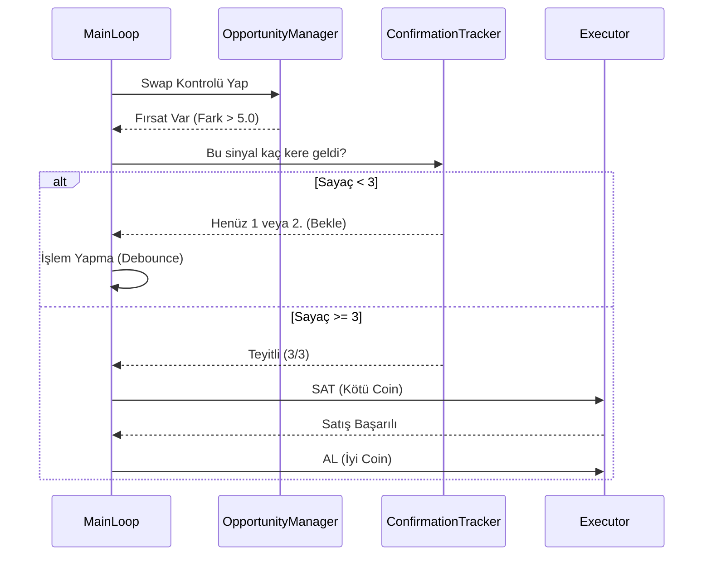

# Proje Algoritma ve Mimari Dokümantasyonu (v2.6)

Bu doküman, Kripto Bot projesinin en güncel (v2.6) teknik mimarisini, algoritma detaylarını ve kod yapısını **en ince ayrıntısına kadar** açıklamaktadır.

---

## 1. Sistem Mimarisi (System Architecture)

Sistem, **Modüler Ajan Mimarisi (Modular Agent Architecture)** üzerine kuruludur. Her bir modül (Ajan), belirli bir sorumluluk alanına sahiptir ve merkezi bir "Main Loop" tarafından koordine edilir.

### Mimari Şema (Mermaid Diagram)

```mermaid
graph TD
%% Veri Katmanı
subgraph Data_Layer [Veri Katmanı]
    DL1[Binance Global API (CCXT)] -->|OHLCV & Ticker| AL1
    DL2[Funding Rate Loader] -->|8h Rates| AL3
    DL3[Sentiment Analyzer] -->|Futures L/S Ratio| AL2
    DL4[Wallet Manager] -->|Balance & Positions| EXEC
end

%% Analiz Katmanı
subgraph Analysis_Layer [Analiz Katmanı]
    AL1[Market Analyzer]
    AL2[Sentiment Score]
    AL3[Funding Strategy]
    AL4[Volume Profile & OrderBook]
    AL5[Market Regime Detector]
    
    AL1 -->|Technical Signals| DL_DECISION
    AL2 -->|Sentiment Boost| DL_DECISION
    AL3 -->|Long/Short Block| DL_DECISION
    AL4 -->|Support/Resistance| DL_DECISION
    AL5 -->|Trend/Range| DL_DECISION
end

%% Karar Katmanı (Decision Engine)
subgraph Decision_Engine [Karar Motoru]
    DL_DECISION{TradeSignal Generator}
    
    DL_DECISION -->|Score Calculation| SCORE[Skor Hesaplama]
    SCORE -->|Base Score| STRAT[Strateji Ağırlıkları]
    STRAT -->|Final Score| FILTERS[Filtreler]
    
    FILTERS -->|Is Safe?| RISK[Risk & Safety Check]
    RISK -->|Approved| SNIPER[Sniper Mode Logic]
    SNIPER -->|Low Balance?| OPP[Opportunity Manager]
    OPP -->|Swap Needed?| CONFIRM[3-Loop Confirmation]
end

%% Öğrenme Katmanı (Learning Layer)
subgraph Learning_Layer [Öğrenme Katmanı (Brain)]
    EXEC -->|Trade Result (PnL)| BRAIN[BotBrain]
    BRAIN -->|Update Weights| STRAT
    BRAIN -->|Ghost Trades| GHOST[Sanal Takip]
    BRAIN -->|Performance Regime| RISK
end

%% Yürütme Katmanı (Execution)
subgraph Execution_Layer [Yürütme Katmanı]
    CONFIRM -->|Approved| EXEC[Executor]
    EXEC -->|Order| BINANCE[Binance Exchange]
    EXEC -->|Sync| WALLET
    WALLET -->|Dust| DUST[Dust Converter]
end

Data_Layer --> Analysis_Layer
Analysis_Layer --> Decision_Engine
Decision_Engine --> Execution_Layer
Execution_Layer --> Learning_Layer
```

---

## 2. Temel Veri Modelleri (Core Data Models)

Sistemin kalbinde, modüller arası veri taşıyan standartlaştırılmış sınıflar bulunur.

### 2.1. TradeSignal (Sinyal Paketi)
`src/strategies/analyzer.py` içinde tanımlıdır. Analiz katmanının çıktısıdır.

```python
class TradeSignal(BaseModel):
    symbol: str
    action: str            # "ENTRY", "EXIT", "HOLD"
    direction: str         # "LONG" (Spot için)
    score: float           # -20.0 ile +20.0 arası puan
    estimated_yield: float # Tahmini getiri (Opsiyonel)
    timestamp: int         # Sinyal üretim zamanı (Unix Epoch)
    details: Dict          # İndikatör değerleri (RSI, MACD vb.)
    primary_strategy: Optional[str] = None # "high_score_override" vb.
```

### 2.2. Market Regime (Piyasa Rejimi)
İki farklı rejim analizi yapılır:
1.  **Teknik Rejim (`src/analysis/market_regime.py`):** Fiyat hareketine dayalı (TRENDING, RANGING).
2.  **Performans Rejimi (`src/learning/brain.py`):** Botun başarısına dayalı (BULL, BEAR, CRASH).

---

## 3. Algoritma Detayları ve Kod Akışı

Botun "Main Loop" (`src/main.py`) içindeki her bir döngüsü şu adımları izler:

### Adım 1: Piyasa Rejimi Tespiti (Market Regime Detection)
Her döngü başında BTC verisi analiz edilir.

```python
# src/analysis/market_regime.py
def detect_regime(self, df: pd.DataFrame) -> Dict[str, Any]:
    # Bollinger Band Genişliği (Volatilite Göstergesi)
    curr_bb_width = (curr['BB_Upper'] - curr['BB_Lower']) / curr['BB_Middle']
    bb_widening = curr_bb_width > prev_bb_width
    
    # ADX (Trend Gücü)
    adx = curr.get('ADX', 0)
    
    if adx > 25 and bb_widening:
        return "TRENDING"
    elif adx < 20 and bb_narrow:
        return "RANGING"
    else:
        return "NEUTRAL"
```

### Adım 2: Sinyal Üretimi ve Puanlama (Scoring System)
Her coin için `analyze_spot` fonksiyonu çalışır. Puanlama **Ağırlıklı Oylama (Weighted Voting)** sistemiyle yapılır.

**Skor Tablosu (Base Score):**

| İndikatör | Koşul | Puan Etkisi | Mantık |
| :--- | :--- | :--- | :--- |
| **RSI** | < 30 (Oversold) | +2.0 | Tepki alımı ihtimali. |
| **RSI** | > 70 (Overbought) | -2.0 | Düşüş riski. |
| **Golden Cross** | SMA7 > SMA25 | +3.0 | Kısa vadeli yükseliş trendi. |
| **Death Cross** | SMA7 < SMA25 | -3.0 | Düşüş trendi. |
| **SuperTrend** | Yeşil (Al) | +2.0 | Trend takibi. |
| **MACD** | Al Sinyali | +1.5 | Momentum artışı. |
| **Bollinger** | Alt Band Teması | +2.0 | Destekten dönüş. |
| **Volume** | Vol > 1.5x Ort. | +1.0 | Hacimli hareket onayı. |
| **Sentiment** | L/S Ratio > 1.2 | +1.5 | Vadeli piyasa beklentisi pozitif. |

**Öğrenen Ağırlıklar (BotBrain):**
Her indikatörün etkisi, botun geçmiş performansına göre dinamik olarak değişir.
```python
# src/learning/brain.py
def update_indicator_weights(self, indicator_signals, pnl_pct):
    lr = 0.02 # Öğrenme hızı
    if is_win:
        # Kazandıran indikatörün ağırlığını artır
        weights[ind] *= (1 + lr)
    else:
        # Kaybettirenin ağırlığını azalt
        weights[ind] *= (1 - lr)
```

### Adım 3: Karar Motoru (Decision Engine)

Sinyaller toplandıktan sonra bot nasıl hareket edeceğine karar verir. İki ana mod vardır:

#### A. Sniper Mode (Düşük Bakiye / All-In)
Eğer bakiye az ise ve portföy doluysa, bot **en iyi fırsata** geçmek için "Swap" (Takas) arar.

**5 Puan Kuralı ve 3-Loop Teyit Mekanizması:**
Botun sürekli al-sat yapıp komisyon eritmesini (Churning) önlemek için katı kurallar vardır.

```python
# src/strategies/opportunity_manager.py

def check_for_swap_opportunity(self, portfolio, market_signals):
    worst_asset = min(portfolio, key=lambda x: x.score) # En kötü coin
    best_opp = max(market_signals, key=lambda x: x.score) # En iyi fırsat
    
    score_diff = best_opp.score - worst_asset.score
    
    # KURAL 1: En az 5.0 puan fark olmalı
    if score_diff < 5.0:
        return None 
        
    return {
        'action': 'SWAP',
        'sell': worst_asset,
        'buy': best_opp
    }
```



#### B. Normal Mod (Yüksek Bakiye)
Bakiye varsa ve `Score > Eşik Değer` (Genelde 1.0) ise alım yapar.

---

## 4. Yürütme ve Güvenlik (Execution & Safety)

`src/execution/executor.py` içindeki mantık, emirlerin borsaya iletilmesini sağlar.

### Dinamik Miktar ve Min Notional Kontrolü
Binance'in "En az 5 USDT'lik işlem" kuralına takılmamak için miktar dinamik ayarlanır.

```python
async def execute_buy(self, symbol, quantity, price):
    # Min Notional (Tutar) Kontrolü
    total_value = quantity * price
    min_notional = 5.5 # USDT (Güvenlik payı ile)
    
    if total_value < min_notional:
        # Eğer bakiye yetiyorsa miktarı artır
        required_qty = min_notional / price
        quantity = required_qty * 1.05 # %5 tampon
        
    # Emir Gönder
    order = await client.create_order(...)
```

### Güvenlik Duvarları (Safety Valves)

1.  **Günlük Zarar Limiti (Hard Stop):**
    ```python
    if daily_pnl < -5.0: # %5 Kayıp
        emergency_stop = True
        log("🛑 GÜNLÜK ZARAR LİMİTİ AŞILDI. İşlemler durduruluyor.")
    ```

2.  **Düşen Bıçak (Falling Knife) Koruması:**
    Eğer fiyat çok hızlı düşüyorsa (RSI < 30 olsa bile) alım yapmaz.

3.  **Zombie Position Koruması:**
    Eğer bir coin hacim sıralamasından düşerse (ilk 400 dışı), bot onu unutmaz. Otomatik olarak tarama listesine ekler ve skorunu takip etmeye devam eder.

4.  **Stablecoin Blacklist:**
    USDT, USDC, FDUSD, TUSD gibi coinler kara listededir, bot bunları asla almaz (Parite/Churning önlemi).

---

## 5. Öğrenme Katmanı (BotBrain)

Bot, her işlemin sonucunu (Kar/Zarar) kaydeder ve buna göre kendini günceller.

### Hayalet İşlemler (Ghost Trades)
Botun filtreye takıldığı için **girmediği** işlemleri sanal olarak takip etmesi özelliğidir.
*"Eğer girseydim ne olurdu?"* sorusunun cevabını arar. Eğer hayalet işlem karlıysa, o filtreyi gevşetir.

```python
def record_ghost_trade(self, symbol, price, reason):
    ghost_trade = {
        "symbol": symbol,
        "entry_price": price,
        "reason": reason, # Örn: "Score < 0.75"
        "status": "ACTIVE"
    }
    self.memory["ghost_trades"].append(ghost_trade)
```

---

## 6. Sıkça Sorulan Sorular ve Sorun Giderme

### S: Bot neden işlem yapmıyor?
1.  **Piyasa Rejimi:** Piyasa "SIDEWAYS" (Yatay) veya "Düşüş" trendinde olabilir.
2.  **Skor Farkı:** Sniper modunda eldeki coinden daha iyi (en az +5 puan) bir fırsat çıkmamıştır.
3.  **3-Loop Teyit:** Fırsat çıkmıştır ama henüz 3 döngü (yaklaşık 15-20 saniye) boyunca kalıcı olmamıştır.

### S: Neden "Score: 0" görüyorum?
Genellikle veri henüz tam yüklenmemiştir veya hesaplama hatası olmuştur. v2.5 güncellemesi ile bu durumlarda varsayılan değer atamak yerine "Bekle" durumuna geçilir.

### S: Bakiye neden 20$'dan 6$'a düştü?
Düşük bakiye ile yapılan testlerde "Min Notional" (Minimum İşlem Tutarı) sınırlarına takılma ve komisyon oranlarının (BNB indirimi yoksa) bakiyeyi eritmesi (Churning) olasıdır. Sniper modu bu yüzden "Sık İşlem" yerine "Nokta Atışı" (Yüksek Skor Farkı) prensibiyle çalışır.
