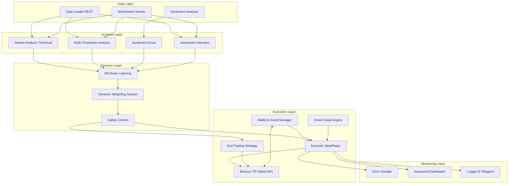

# Kripto Bot Projesi - Algoritma ve Mimari Dokümantasyonu (v1.6)

Bu belge, Kripto Bot projesinin güncellenmiş sistem mimarisini, algoritma akışını ve eklenen yeni modülleri (Makine Öğrenmesi, Risk Yönetimi, Ensemble Modeller vb.) detaylı bir şekilde açıklamaktadır. Sistem, otomatik ticaret, risk yönetimi ve veri analizi süreçlerini yönetmek için modüler bir yapıda tasarlanmıştır.

## 1. Sistem Mimarisi

Sistem, veri toplama, çok boyutlu analiz, karar verme (beyin), yürütme ve gelişmiş izleme olmak üzere beş ana katmandan oluşur.

### Yeni ve Güncellenen Bileşenler (v1.6)

1.  **Data Layer (Veri Katmanı):**
    *   **Full Market Scan:** Bot artık Binance TR üzerindeki **tüm aktif TRY çiftlerini** (1000+ sembol) tarayabilmektedir.
    *   **BinanceWebSocket (`src/collectors/binance_websocket.py`):** Anlık fiyat ve ticker verilerini WebSocket üzerinden canlı olarak çeker.
    *   **SentimentAnalyzer (`src/sentiment/analyzer.py`):** Twitter ve Reddit üzerinden coin ile ilgili sosyal medya duygu analizi yapar.

2.  **Analysis Layer (Analiz Katmanı):**
    *   **Market Analyzer (`src/strategies/analyzer.py`):** İndikatör yelpazesi genişletildi. Artık **SuperTrend, CCI, ADX, MFI** ve **Formasyon Tanıma (Doji, Hammer, Engulfing)** özelliklerini içerir.
    *   **Order Book Analyzer (`src/market_structure/orderbook_analyzer.py`):** Derinlik verilerini analiz eder (Balina Tespiti, Dengesizlik, Destek/Direnç Teyidi).
    *   **Volume Profile Analyzer (`src/market_structure/volume_profile.py`):** Hacim dağılımını analiz eder (POC, VAH/VAL).
    *   **MultiTimeframeAnalyzer (`src/strategies/multi_timeframe.py`):** 15m, 1h, 4h ve 1d grafiklerini eş zamanlı analiz eder.

3.  **Decision Layer (Karar Katmanı):**
    *   **Ensemble Model Manager (`src/ml/ensemble_manager.py`):** RandomForest, XGBoost ve LightGBM algoritmalarını içeren yapay zeka modülü.
    *   **Bot Brain & Adaptive Learning (`src/learning/brain.py`):** Bot, her işlemin sonucuna (Kâr/Zarar) göre strateji ve indikatörlerin ağırlıklarını dinamik olarak günceller.
    *   **Dynamic Scoring:** Her indikatör Brain tarafından belirlenen ağırlığıyla genel puana katkıda bulunur.

4.  **Execution Layer (Yürütme Katmanı):**
    *   **Binance Executor (`src/execution/executor.py`):** Ana emir yönetim modülü. Hassasiyet (Precision) ve Min Limit hataları giderildi.
    *   **Smart Swap Engine:** Yetersiz bakiye durumunda takas yapar. **Risk Filtresi (Portfolio Optimizer)** entegre edildi.
    *   **Wallet & Asset Manager (Auto-Import):** Binance cüzdanındaki mevcut varlıkları otomatik olarak tespit eder.
    *   **Grid Trading (`src/strategies/grid_trading.py`):** Yatay piyasalarda grid emirleri oluşturur.

5.  **Monitoring Layer (İzleme Katmanı):**
    *   **Advanced Dashboard (`src/dashboard.py`):** Canlı Cüzdan Bakiyesi, Varlık Tablosu, Yeni İndikatör Skorları ve Bot Yorumları.

---

## 2. Güncellenmiş Algoritma Akışı

Botun karar mekanizması artık cüzdan durumuyla tam entegre çalışmaktadır:

### Adım 1: Veri Toplama ve Cüzdan Senkronizasyonu
*   **Geniş Tarama:** Tüm Binance TR pariteleri taranır.
*   **Cüzdan Sync:** Belirli aralıklarla Binance TR hesabındaki TRY ve Coin bakiyeleri çekilir.
*   **Auto-Import:** Cüzdanda bulunan coinler otomatik olarak botun yönetimine geçer.

### Adım 2: Çok Boyutlu ve Adaptif Sinyal Üretimi
*   **Gelişmiş Teknik Analiz:** SuperTrend, CCI, ADX, MFI ve Formasyonlar hesaplanır.
*   **Adaptif Puanlama:** Brain modülünden gelen dinamik ağırlıklar kullanılarak her coin için bir "Güven Skoru" oluşturulur.
*   **MTF Onayı:** Kısa ve uzun vade trend uyumu kontrol edilir.

### Adım 3: Yürütme ve Strateji Seçimi
*   **Alım (Buy):** Yeterli bakiye varsa ve skor yüksekse alım yapılır.
*   **Satım (Sell):** Satış sinyali gelirse satış yapılır. İşlem sonucu (PnL) Brain'e iletilir.
*   **Akıllı Takas (Smart Swap):** Bakiye yetersizse, eldeki en düşük puanlı varlık ile piyasadaki yüksek puanlı fırsat karşılaştırılır. **Korelasyon Riski** kontrol edilir.

### Adım 4: Risk Yönetimi
*   **Günlük Kayıp Limiti:** Belirlenen zarar eşiği aşılırsa bot otomatik durur.
*   **ATR Trailing Stop (İz Süren Stop):** Pozisyon kâra geçtikçe stop seviyesini yukarı çeker.
*   **Volatilite Bazlı Pozisyon Büyüklüğü:** Çok volatil coinlerde pozisyonu küçültür.

---

## 3. Bot Brain: Karar Mekanizması ve İndikatörler

Botun "Beyni" (`brain.py`), sadece teknik analiz verilerini okumakla kalmaz, aynı zamanda geçmiş tecrübelerinden öğrenerek kararlarını sürekli iyileştirir.

### 3.1. Kullanılan İndikatörler
1.  **Trend Takipçileri:** SuperTrend, SMA, EMA, MACD, ADX.
2.  **Momentum ve Osilatörler:** RSI, StochRSI, CCI, MFI.
3.  **Volatilite ve Hacim Profili:** Bollinger Bands, VWAP.
4.  **Formasyonlar:** Doji, Hammer, Bullish Engulfing.

### 3.2. Bot Nasıl Düşünür? (Adaptive Learning)
*   **Pekiştirmeli Öğrenme (Reinforcement Learning):** Başarılı işlemlerden sonra ilgili indikatörlerin ağırlığı artar, başarısızlardan sonra azalır.

---

## 4. Gelişmiş Risk Yönetimi (v1.6)

Bot, sadece sinyal üretmekle kalmaz, aynı zamanda üretilen sinyallerin portföy üzerindeki riskini de analiz eder.

### 4.1. Portfolio Optimizer (Risk Yöneticisi)
*   **Modül:** `src/risk/portfolio_optimizer.py`
*   **Korelasyon Analizi:** Bot, yeni bir varlık almadan önce, bu varlığın mevcut portföydeki diğer varlıklarla olan korelasyonunu (ilişkisini) kontrol eder.
*   **Modern Portföy Teorisi (MPT):** Korelasyon matrisi kullanılarak varlıkların birbirine bağımlılığı ölçülür.
*   **Çeşitlendirme:** Eğer aday coin, portföydeki coinlerle çok yüksek korelasyona sahipse (Eşik Değer: **0.80**), bu işlem "Riskli" olarak işaretlenir.
*   **Amaç:** Portföy riskini dağıtmak. Örneğin, Bitcoin düşerken tüm portföyün aynı anda çökmesini engellemek için birbirine daha az bağımlı varlıklar seçilir.

### 4.2. Opportunity Manager Entegrasyonu
*   **Akıllı Seçim:** Fırsat Maliyeti Yöneticisi (`src/strategies/opportunity_manager.py`), eldeki kötü performans gösteren bir varlığı satıp yerine yenisini alırken artık sadece puan farkına bakmaz.
*   **Risk Filtresi:** Aday coinin portföyün geri kalanıyla uyumunu (korelasyonunu) kontrol eder. Yüksek riskli (aşırı korele) adaylar, puanı yüksek olsa bile elenir.
*   **Güvenli Takas:** Sadece **"Daha Yüksek Skor + Düşük Korelasyon"** sağlayan fırsatlar değerlendirilir.

## 5. Teknik İyileştirmeler ve Hata Düzeltmeleri (v1.6)

*   **TradeSignal Import Fix:** Veri sınıflarının modüller arası taşınması sırasında oluşan `UnboundLocalError` hatası, `src/main.py` içinde eksik importların eklenmesiyle giderildi.
*   **Performans:** Risk analizi hesaplamaları, pandas kullanılarak vektörize edildi ve performans kaybı minimize edildi.
*   **Execution Safety (Balance Synchronization):** Bakiye hatası (Code 2202/Insufficient Balance) alındığında, bot artık ilgili pozisyonu "hayalet pozisyon" olarak algılar ve otomatik olarak hafızasından siler. Bu sayede sonsuz swap döngüleri ve kilitlenmeler engellenir.
