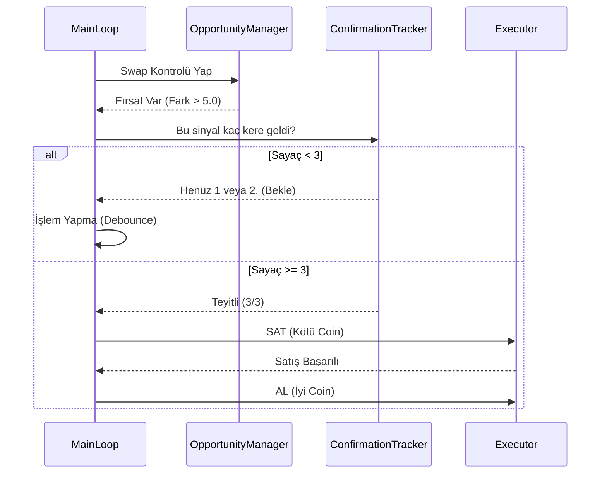

# Proje Algoritma ve Mimari Dokümantasyonu (v2.8 - Professional Standards)

Bu doküman, Kripto Bot projesinin en güncel (v2.8) teknik mimarisini, algoritma detaylarını ve kod yapısını **en ince ayrıntısına kadar** açıklamaktadır.

---

## 1. Sistem Mimarisi (System Architecture)

Sistem, **Modüler Ajan Mimarisi (Modular Agent Architecture)** üzerine kuruludur. Her bir modül (Ajan), belirli bir sorumluluk alanına sahiptir ve merkezi bir "Main Loop" tarafından koordine edilir.

Yüksek seviyede katmanlar:

- **Veri Katmanı (Data Layer):** Borsa fiyat/veri sağlayıcıları (CCXT tabanlı loader’lar), funding oranı yükleyicisi, sentiment analizörü, cüzdan/bakiye yönetimi, veritabanı (`DatabaseHandler`) ve ML eğitim verisi (`ml_training_data.csv`) üretimi.
- **Analiz Katmanı (Analysis Layer):** `MarketAnalyzer`, `StrategyManager`, `OrderBookAnalyzer`, `VolumeProfileAnalyzer`, `MarketRegimeDetector`, `FundingAwareStrategy`, `EnsembleManager`. Her biri kendi alanında skor/feature üretir.
- **Karar Motoru (Decision Engine):** `TradeManager`, `OpportunityManager`, `StopLossManager` ve güvenlik filtreleri. Sinyalleri birleştirir, risk kontrollerini uygular, Sniper/Normal mod kararını verir.
- **Yürütme Katmanı (Execution Layer):** `Executor` ve borsa API adaptörleri. Emir gönderme, **maker-first limit + market fallback** akışı, minNotional uyumu, slippage ve bakiye senkronu burada.
- **Öğrenme Katmanı (Learning Layer):** `BotBrain` ve `EnsembleManager`’ın eğitim tarafı. Geçmiş işlemlerden ve kayıtlı snapshot’lardan öğrenir.

### 1.1. Dashboard ve State Dosyası Mimarisi

- Canlı dashboard ve bot, **tek bir kanonik state dosyası** üzerinden senkron çalışır:
  - Dosya: `data/bot_state_live.json`
  - Bot tarafı: `config.settings.STATE_FILE = "data/bot_state_live.json"`
  - Docker Compose:
    - `bot-live` environment: `STATE_FILE=data/bot_state_live.json`
    - `dashboard-live` environment: `STATE_FILE=data/bot_state_live.json`
  - Her iki servis de aynı volume’a bağlıdır: `./data -> /app/data`
- Dashboard tarafında `resolve_state_file` helper’ı, env değeri yanında aşağıdaki fallback yolları da sırayla dener:
  - `data/bot_state_live.json`, `data/bot_state.json`, `bot_state_live.json`, `bot_state.json`, `local_backup_data/bot_state_live.json`, `local_backup_data/bot_state.json`
- `ensure_state_file(path)` fonksiyonu ile dashboard açılırken state dosyası yoksa otomatik olarak oluşturulur:
  - Gerekli klasörler oluşturulur (`/app/data`).
  - İçerik en azından `{ "is_live": True/False }` içeren geçerli bir JSON olarak yazılır.
  - Böylece dosya eksik ya da bozuk olsa bile dashboard, “State is None (File Load Failed)” yerine kontrollü bir uyarı ile açılır; UI hiç bir aşamada çökmeyecek şekilde tasarlanmıştır.

### Mimari Şema (Mermaid Diagram)

```mermaid
graph TD
%% Veri Katmanı
subgraph Data_Layer [Veri Katmanı]
    DL1[Binance Global API (CCXT)] -->|OHLCV & Ticker| AL1
    DL2[Funding Rate Loader] -->|8h Rates| AL3
    DL3[Sentiment Analyzer] -->|Futures L/S Ratio| AL2
    DL4[Wallet Manager] -->|Balance & Positions| EXEC
end

%% Analiz Katmanı
subgraph Analysis_Layer [Analiz Katmanı]
    AL1[Market Analyzer]
    AL2[Sentiment Score]
    AL3[Funding Strategy]
    AL4[Volume Profile & OrderBook]
    AL5[Market Regime Detector]
    AL6[ML Ensemble Model]
    
    AL1 -->|Technical Signals| DL_DECISION
    AL6 -->|Prob Score| DL_DECISION
    AL2 -->|Sentiment Boost| DL_DECISION
    AL3 -->|Long/Short Block| DL_DECISION
    AL4 -->|Support/Resistance| DL_DECISION
    AL5 -->|Trend/Range| DL_DECISION
end

%% Karar Katmanı (Decision Engine)
subgraph Decision_Engine [Karar Motoru (TradeManager)]
    DL_DECISION{TradeSignal Generator}
    
    DL_DECISION -->|Score Calculation| SCORE[Skor Hesaplama]
    SCORE -->|Base Score| STRAT[Strateji Ağırlıkları]
    STRAT -->|Final Score| FILTERS[Filtreler]
    
    FILTERS -->|Is Safe?| RISK[Risk & Safety Check]
    RISK -->|Approved| TM[TradeManager Orchestrator]
    TM -->|Sniper Mode Logic| SNIPER[Sniper Handler]
    SNIPER -->|Low Balance?| OPP[Opportunity Manager]
    OPP -->|Swap Needed?| CONFIRM[3-Loop Confirmation]
    CONFIRM -->|Approved| TM
end

%% Öğrenme Katmanı (Learning Layer)
subgraph Learning_Layer [Öğrenme Katmanı (Brain)]
    TM -->|Trade Result (PnL)| BRAIN[BotBrain]
    BRAIN -->|Update Weights| STRAT
    BRAIN -->|Ghost Trades| GHOST[Sanal Takip]
    BRAIN -->|Performance Regime| RISK
end

%% Yürütme Katmanı (Execution)
subgraph Execution_Layer [Yürütme Katmanı]
    TM -->|Execute Strategy| EXEC[Executor]
    EXEC -->|Order| BINANCE[Binance Exchange]
    EXEC -->|Sync| WALLET
    WALLET -->|Dust| DUST[Dust Converter]
end

Data_Layer --> Analysis_Layer
Analysis_Layer --> Decision_Engine
Decision_Engine --> Execution_Layer
Execution_Layer --> Learning_Layer
```

---

## 2. Temel Veri Modelleri (Core Data Models)

Sistemin kalbinde, modüller arası veri taşıyan standartlaştırılmış sınıflar bulunur.

### 2.1. TradeSignal (Sinyal Paketi)
`src/strategies/analyzer.py` içinde tanımlıdır. Analiz katmanının standart çıktısıdır ve artık skor alanı hem üretim tarafında hem de model seviyesinde clamp edilerek güvence altına alınır.

```python
class TradeSignal(BaseModel):
    symbol: str
    action: str            # "ENTRY", "EXIT", "HOLD"
    direction: str         # "LONG", "SHORT", "LONG_SPOT_SHORT_PERP"
    score: float           # Canonic aralık: [-20, 40] (mock: [-20, 20])
    estimated_yield: float
    timestamp: int
    details: Dict
    primary_strategy: Optional[str] = None

    @field_validator("score")
    @classmethod
    def clamp_score(cls, v: float) -> float:
        max_cap = 40.0
        if settings.USE_MOCK_DATA:
            max_cap = 20.0
        return max(-20.0, min(max_cap, float(v)))
```

### 2.2. Market Regime (Piyasa Rejimi)
İki farklı rejim analizi yapılır:
1.  **Teknik Rejim (`src/analysis/market_regime.py`):** Fiyat hareketine dayalı (TRENDING, RANGING, NEUTRAL) ve No-Trade Zone tespiti.
2.  **Performans Rejimi (`src/learning/brain.py`):** Botun geçmiş işlem performansına dayalı (BULL, BEAR, CRASH, NEUTRAL).

```python
# src/analysis/market_regime.py
def detect_regime(self, df: pd.DataFrame) -> Dict[str, Any]:
    if df.empty or len(df) < 2:
        return {'regime': 'UNKNOWN', 'details': 'Insufficient data'}
    curr = df.iloc[-1]
    prev = df.iloc[-2]
    curr_bb_width = (curr['BB_Upper'] - curr['BB_Lower']) / curr['BB_Middle'] if curr['BB_Middle'] > 0 else 0
    prev_bb_width = (prev['BB_Upper'] - prev['BB_Lower']) / prev['BB_Middle'] if prev['BB_Middle'] > 0 else 0
    bb_widening = curr_bb_width > prev_bb_width
    bb_narrow = curr_bb_width < 0.05
    adx = curr.get('ADX', 0)
    regime = "NEUTRAL"
    if adx > 25 and bb_widening:
        regime = "TRENDING"
    elif adx < 20 and bb_narrow:
        regime = "RANGING"
    is_no_trade = self._check_no_trade_zone(df, curr, adx)
    return {
        'regime': regime,
        'is_no_trade_zone': is_no_trade,
        'adx': adx,
        'bb_width': curr_bb_width,
        'bb_widening': bb_widening
    }
```

Performans rejimi ise `BotBrain.analyze_market_regime` ile hesaplanır ve aşağıdaki alanları döndürür:

```python
{
  "status": "BULL" | "BEAR" | "CRASH" | "NEUTRAL",
  "win_rate_24h": float,
  "avg_pnl_24h": float
}
```

---

## 3. Algoritma Detayları ve Kod Akışı

Botun "Main Loop" (`src/main.py`) içindeki her bir döngüsü şu adımları izler:

### Adım 1: Piyasa Rejimi Tespiti (Market Regime Detection)
Her döngü başında BTC verisi analiz edilir.

```python
# src/analysis/market_regime.py
def detect_regime(self, df: pd.DataFrame) -> Dict[str, Any]:
    # Bollinger Band Genişliği (Volatilite Göstergesi)
    curr_bb_width = (curr['BB_Upper'] - curr['BB_Lower']) / curr['BB_Middle']
    bb_widening = curr_bb_width > prev_bb_width
    
    # ADX (Trend Gücü)
    adx = curr.get('ADX', 0)
    
    if adx > 25 and bb_widening:
        return "TRENDING"
    elif adx < 20 and bb_narrow:
        return "RANGING"
    else:
        return "NEUTRAL"
```

### Adım 2: Sinyal Üretimi ve Puanlama (Scoring System)
Her coin için `MarketAnalyzer.analyze_spot` çalışır. Puanlama **Multi-Strategy + Weighted Voting** hibrit modeliyle yapılır.

Adım adım akış (sadeleştirilmiş pseudo-code):

1. **Indikatör Hesabı:**
   - `calculate_indicators(candles)` çağrılır.
   - EMA 9/21, klasik SMA 7/25, RSI, Stoch RSI, MACD, Bollinger bandları, ATR, hacim ortalaması ve `Volume_Ratio`, pattern flag’leri (doji/hammer/bullish engulfing) üretilir.
   - Üretilen DataFrame, son **tamamlanmış** mum (`iloc[-2]`) ve bir önceki mum (`iloc[-3]`) üzerinden kullanılır (repainting/çizim hatası önlenir).

2. **Piyasa Rejimi:**
   - `MarketRegimeDetector.detect_regime(df)` çağrısı ile `regime` ve `is_no_trade_zone` belirlenir.
   - Rejime göre ağırlıklar dinamik ayarlanır:
     - TRENDING: trend/EMA ağırlıkları ↑, oversold bounce ağırlığı bir miktar ↓.
     - RANGING/SIDEWAYS: trend ağırlığı ↓, oversold bounce ağırlığı ↑ (range trading’e kayış).

3. **Strateji Katmanı (StrategyManager):**
   - `strategy_manager.analyze_all(df, symbol, exchange)` birden çok stratejiyi (momentum, mean reversion, multi-timeframe vb.) paralel düşünerek:
     - Her strateji için aksiyon (`ENTRY`/`HOLD`/`EXIT`) ve skor üretir.
     - Strateji ağırlıklarına göre birleşik `weighted_score` ve `primary_strategy` döndürür.
   - Bu aşamanın çıktısı:
     - `action`: İlk brüt aksiyon (genellikle ENTRY veya HOLD).
     - `score`: İlk brüt skor (henüz ML, funding, sentiment, risk uygulanmamış).

4. **ML Katmanı (EnsembleManager):**
   - `ml_prob = ensemble.predict_proba(df)` çağrılır:
     - Model yok, feature eksik veya hata durumunda **otomatik 0.5 (nötr)** döner.
   - Skora katkı:
     - `ml_score_contribution = (ml_prob - 0.5) * 20.0`
     - Örnek: `ml_prob = 0.8` → +6 puan, `ml_prob = 0.2` → -6 puan.

5. **Order Book ve Volume Profile Katmanı:**
   - Emir defteri sağlandıysa:
     - `OrderBookAnalyzer.analyze_depth(order_book, close)` ile:
       - Alım/satım duvarları, likidite derinliği ve dengesizlik oranı hesaplanır.
     - `get_score_impact` ile bu analiz skora (+/-) etkilenir.
   - Hacim profili:
     - `VolumeProfileAnalyzer.calculate_profile(candles)` ile fiyat-hacim dağılımı çıkarılır.
     - `get_score_impact(close, profile)` ile destek/direnç bölgesine göre pozitif/negatif katkı eklenir.
   - Order book analiz sonuçları `TradeSignal.details` içine `orderbook_pressure`, `orderbook_imbalance` ve `orderbook_spread_pct` alanlarıyla yazılır; bu alanlar `SignalValidator` içinde mikro-yapı filtresi olarak kullanılır ve özellikle **ENTRY-LONG** akışında ağır satış baskısı + geniş spread kombinasyonlarını tamamen veto edebilir.

6. **Trend ve RSI Tabanlı Skor:**
   - Trend:
     - `sma_short > sma_long` ise trend puanı ve hacim destekliyse ek bonus verilir.
     - `sma_short < sma_long` ise trend cezası uygulanır.
   - Golden/Death Cross:
     - Önceki mum ve güncel mum SMA kesişimleri üzerinden hem skor hem de “trend onayı” katkısı gelir.
   - RSI ve Dinamik Eşikler:
     - `rsi_overbought` / `rsi_oversold` değerleri ADX ve rejime göre dinamik belirlenir.
     - RSI < oversold → oversold bounce puanı.
     - RSI > overbought → satış baskısı puanı (negatif).

7. **Falling Knife ve Trend Güvenlik Katmanı:**
   - Fiyat SMA_Long altında ve SuperTrend yönü aşağı ise:
     - Ek “Falling Knife” cezası uygulanır; bu, WIF benzeri sürekli düşen coinleri “ucuz görünüp” alınmasını zorlaştırır.
   - Hafif düşüş veya güçlü yükseliş senaryolarında daha küçük ceza/bonuslar vardır.

8. **Sentiment Katmanı:**
   - Piyasa duyarlılığı (örneğin futures long/short ratio) sağlanmışsa:
     - Sentiment skoru -1 ile +1 arası normalize edilir.
     - Skora `sentiment_score * 5.0 * w_sentiment` kadar katkı eklenir.
   - Sentiment çok negatif ise (`sentiment_score < -0.5`) ve aksiyon `ENTRY` ise:
     - Sinyal tamamen veto edilip `HOLD`’a dönebilir.

9. **Funding Katmanı (FundingAwareStrategy):**
   - `funding_strategy.analyze_funding(symbol)` çağrısı:
     - `score_boost`: Pozitif/negatif funding’e bağlı skor düzeltmesi.
     - `action`: Özellikle negatif funding’de `IGNORE_LONG` gibi sinyal bloklayıcı aksiyon.
     - `funding_rate_pct`: Son funding oranı.
   - Sonuç:
     - `score += f_score`.
     - Eğer `f_action == 'IGNORE_LONG'` ise:
       - `action = "HOLD"`, `primary_strategy = "blocked_by_negative_funding"`.
       - Detaylara `funding_rate_pct` işlenir.

10. **No-Trade Zone ve Çıkış Mantığı:**
    - `is_no_trade_zone` True ve aksiyon `ENTRY` ise:
      - Aksiyon `HOLD`’a çevrilir ve sebep alanına “blocked_by_no_trade_zone” yazılır.
    - Çıkış mantığı:
      - `sma_short < sma_long` ise skor bir miktar azaltılır.
      - Death cross veya SuperTrend düşüşte ise ek skor cezalarıyla `EXIT` kararı desteklenir.

11. **High Score Override (Yüksek Skor Baskınlığı):**
    - Skor ≥ 2.5 ve aksiyon `ENTRY` değilse:
      - Sentiment çok negatif değilse (`>= -0.2`):
        - `action = "ENTRY"`.
        - `primary_strategy = "high_score_override"`.
        - `is_blocked = False` (önceki bloklar geçersiz sayılır).
    - Bu mekanizma, çok güçlü konsensüslerde bazı hafif bloklayıcıların üzerinden atlamayı sağlar; ancak funding ve sentiment çok olumsuzsa override devreye giremez.

12. **ML Snapshot Kaydı (Veri Toplama):**
    - Skor |score| > 5.0 veya `%1` rastgelelik ile:
      - `EnsembleManager.save_snapshot(df, symbol)` çağrılır.
      - Bu, `data/ml_training_data.csv` dosyasına son satırın özet feature setini ekleyerek ilerideki eğitimler için dataset’i büyütür.

13. **Skor Clamp ve TradeSignal Üretimi:**
    - Skor None ise 0.0 yapılır.
    - Skor canlıda **[-20, 40]**, mock ortamda **[-20, 20]** aralığında clamp edilir.
    - `TradeSignal` Pydantic modeli ikinci bir güvenlik katmanı olarak aynı clamp mantığını alan seviyesinde uygular.
    - Son olarak:
      - `TradeSignal.score`, `details` içinde tüm ara sinyaller, funding, volatilite ve son 50 kapanış (`price_history`) ile birlikte döndürülür.

**Öğrenen Ağırlıklar (BotBrain):**
Her indikatör/stratejinin etkisi, botun geçmiş performansına göre dinamik olarak değişir.
```python
# src/learning/brain.py
def update_indicator_weights(self, indicator_signals, pnl_pct):
    lr = 0.02 # Öğrenme hızı
    if is_win:
        # Kazandıran indikatörün ağırlığını artır
        weights[ind] *= (1 + lr)
    else:
        # Kaybettirenin ağırlığını azalt
        weights[ind] *= (1 - lr)
```

### Adım 3: Karar Motoru (TradeManager)

Sinyaller toplandıktan sonra `TradeManager` sınıfı tüm akışı yönetir. Bu modül, sinyalleri filtreler, risk kontrollerini yapar ve uygun stratejiyi (Sniper veya Normal) seçer.

#### A. Sniper Mode (Düşük Bakiye / All-In)
Eğer bakiye az ise ve portföy doluysa, bot **en iyi fırsata** geçmek için "Swap" (Takas) arar.

**5 Puan Kuralı ve 3-Loop Teyit Mekanizması:**
Botun sürekli al-sat yapıp komisyon eritmesini (Churning) önlemek için katı kurallar vardır. Bu mantık `TradeManager.handle_sniper_mode` içinde yürütülür.

```python
# src/execution/trade_manager.py

async def handle_sniper_mode(self, all_market_signals, current_prices_map):
    # ...
    score_diff = best_signal.score - worst_position_score
    
    if score_diff >= 5.0:
        # 3-Loop Confirmation (Debounce)
        self.swap_confirmation_tracker[symbol] += 1
        if self.swap_confirmation_tracker[symbol] >= 3:
             # EXECUTE SWAP
             await self.executor.execute_strategy(sell_signal)
             await self.executor.execute_strategy(buy_signal)
```


```mermaid
sequenceDiagram
participant MainLoop
participant OpportunityManager
participant ConfirmationTracker
participant Executor

MainLoop->>OpportunityManager: Swap Kontrolü Yap
OpportunityManager-->>MainLoop: Fırsat Var (Fark > 5.0)

MainLoop->>ConfirmationTracker: Bu sinyal kaç kere geldi?

alt Sayaç < 3
    ConfirmationTracker-->>MainLoop: Henüz 1 veya 2. (Bekle)
    MainLoop->>MainLoop: İşlem Yapma (Debounce)
else Sayaç >= 3
    ConfirmationTracker-->>MainLoop: Teyitli (3/3)
    MainLoop->>Executor: SAT (Kötü Coin)
    Executor-->>MainLoop: Satış Başarılı
    MainLoop->>Executor: AL (İyi Coin)
end
```

##### 3.1.1. Süper Sinyal Hızlı Yol (Fast Path) – Güvenli
- Koşul: En iyi sinyal skoru ≥32 (ZAMA/USDT için ≥31) ve eldeki varlığa göre skor farkı ≥20.
- Aksiyon: Mevcut pozisyon derhal satılır, ardından 5 sn beklenir ve cüzdan bakiyesi senkronize edilir.
- Yeniden Doğrulama: Alımdan hemen önce sinyal skoru eşik üzerinde mi ve fiyat kayması (slippage) ≤%1 mi kontrol edilir; şartlar bozulduysa alım iptal edilir.
- Korelasyon: Süper sinyallerde korelasyon filtresi bypass edilir; diğerlerinde korelasyon >0.85 ise atlanır.
- Not: Mock/Test ortamında (USE_MOCK_DATA=True) hızlı akışta satış sonrası aynı döngüde alım tetiklenebilir; canlıda bakiye senkronizasyonu beklidir.

##### 3.1.2. Kilit Kırma (Hold-Time Lock Override)
- Koşul: Skor farkı ≥20 olduğunda, “kilitli varlık/hold-time” engeli tüm modlarda aşılır.
- Amaç: Çok yüksek fırsat farklarında bekleme nedeniyle fırsat kaçırmayı engellemek.
- Sabit: LOCK_BREAK_THRESHOLD = 20.0 (Genel kural; Sniper ve Normal modlarda geçerli).

##### 3.1.2.1. OpportunityManager ve Net Skor (Funding Erozyonu)

Sniper modunda swap adayı seçilirken sadece ham skor değil, funding maliyeti de dikkate alınır. Bu mantık `src/strategies/opportunity_manager.py` içindeki `_get_net_score` fonksiyonunda kodlanmıştır:

- `base_score = signal.score`
- `funding_rate_pct = details["funding_rate_pct"]` (8 saatlik oran).
- Günlük maliyet yaklaşık `abs(funding_rate_pct) * 3.0` ile hesaplanır.
- Ağırlık: `OPP_FUNDING_WEIGHT` (settings’ten okunur, yoksa 1.0).
- Net skor: `base_score - daily_cost * weight`

Buna göre:

- Çok negatif funding’e sahip pozisyonlar (örneğin MOVE/USDT’de -0.38% funding) net skoru hızla aşağı çekerek “satılmaya aday” coin haline gelir.
- Sıralama:
  - Portföy içi en kötü net skorlu varlık: `worst_asset`
  - Portföyde olmayan, `ENTRY` aksiyonlu sinyaller arasından en iyi net skor: `candidate`
- Swap kararı:
  - `score_diff = net_score(candidate) - net_score(worst_asset)`
  - `score_diff` hem minimum fark eşiğini (`min_score_diff`) hem de kilit kırma eşiğini (`LOCK_BREAK_THRESHOLD`) geçiyorsa ve korelasyon kontrolü güvenliyse, swap onaylanır.

Ek korumalar:

- `BNB/USDT` hiçbir zaman “satılmaya aday” listeye alınmaz (komisyon indirimi ve base asset koruması).
- Çok küçük pozisyonlar için (`< MIN_TRADE_AMOUNT_USDT`) gereksiz swap yapılmaz.

##### 3.1.3. Adaptif Sniper Eşiği
- Volatilite düşükse gerekli skor farkı 3.5’e iner; yüksek volatilitede 5.0 olarak kalır.
- Eşik hesaplaması, en iyi sinyalin `details.volatility` alanına dayalıdır.
- Teyit: Gerekli fark sağlanırsa 3 döngü (3/3) teyit sonrası satış tetiklenir; “super signal” hızlı yolunda ≥20 fark varsa anında satış yapılır.

##### 3.1.4. Alım Öncesi Yeniden Doğrulama
- Normal Yol: Skor ≥0.75 olmalı. Mock/Test ortamında slippage kontrolü atlanır.
- Süper Sinyal Yolu: Skor (≥32 veya ZAMA için ≥31) korunmalı ve slippage ≤%1 olmalı. Mock/Test ortamında da bu kontrol uygulanabilir.

##### 3.1.5. Operasyonel Notlar
- Bakiye Senkronu: Canlıda satış sonrası 5 sn beklenir ve cüzdan senkronize edilir; Mock/Test ortamında bazı akışlarda satışla aynı döngü içinde alım tetiklenebilir.
- Kilit Kırma: LOCK_BREAK_THRESHOLD = 20.0; skor farkı ≥20 ise hold-time kilidi bypass edilir.
- Dust Koruması: convert_dust_to_bnb aktif pozisyonları (10 USDT altı olsa bile) atlar; yanlışlıkla süpürme engellenir.
- Skor Kapası: Mock/Test ortamında skor [-20, 20], canlıda [-20, 40]; 31+ “super signal” canlıda korunur.
- Slippage Kontrolü: Normal alımlarda Mock/Test ortamında slippage kontrolü atlanır; süper sinyal yolunda canlıda zorunlu, mock’ta uygulanabilir.
- Korelasyon: Süper sinyaller için korelasyon filtresi bypass edilebilir; standart akışta yüksek korelasyon (>0.85) atlama sebebidir.
- Maker-First Emir Akışı: `EXEC_PREFER_MAKER=True` iken önce borsadan anlık order book çekilerek hafifçe içeriye yerleştirilmiş bir **limit (maker)** emri gönderilir; `EXEC_MAKER_TIMEOUT_SEC` süresi içinde en az `EXEC_MAKER_MIN_FILL_PCT` oranında dolum gelmezse emir iptal edilir ve aynı miktar için **market taker** fallback’i devreye girer.
- Mikro-Yapı Filtreleri: Order book’tan elde edilen `orderbook_pressure`/`orderbook_imbalance`/`orderbook_spread_pct` alanları, `MICROSTRUCTURE_MAX_SPREAD_PCT` eşiği ile birlikte `SignalValidator` üzerinde giriş sinyallerini tamamen veto edebilen ayrı bir güvenlik katmanı olarak çalışır; veto edilen akışlar `Brain` tarafında ghost trade olarak kaydedilir.

#### B. Normal Mod (Yüksek Bakiye)
Bakiye varsa ve `Score > Eşik Değer` (Genelde 1.0) ise alım yapar.

---

## 4. Yürütme ve Güvenlik (Execution & Safety)

`src/execution/executor.py` içindeki mantık, emirlerin borsaya iletilmesini sağlar.

### Dinamik Miktar ve Min Notional Kontrolü
Binance'in minimum işlem tutarı (minNotional) kuralına takılmamak için miktar **borsadan dinamik okunur** ve buna göre ayarlanır.

```python
async def execute_buy(self, symbol: str, quantity: float, price: float, features: dict = None) -> bool:
    notional_value = price * quantity
    if not self.is_live:
        if notional_value < self.min_trade_amount:
            return False
    if self.is_live:
        qty_to_send = quantity
        info = await self.get_symbol_info(symbol)
        min_notional = 5.0
        if info:
            min_notional = float(info.get('minNotional', 5.0))
        if (qty_to_send * price) < min_notional:
            base_asset = 'USDT'
            check_balance = await self.get_free_balance(base_asset)
            check_leverage = settings.LEVERAGE if settings.TRADING_MODE == 'futures' else 1.0
            max_afford_notional = check_balance * check_leverage * 0.98
            required_bump_notional = min_notional * 1.05
            if max_afford_notional < required_bump_notional:
                return False
            qty_to_send = required_bump_notional / price
        # burada borsa emri gönderilir
```

### Satış Sonrası Senkronizasyon ve Alım Öncesi Doğrulama
- Satıştan sonra 5 saniye beklenir ve cüzdan bakiyesi zorla senkronize edilir (bakiye gecikmeleri için).
- Alım öncesi sinyal yeniden doğrulanır: skor eşik üzerinde mi ve slippage ≤%1 mi.
- Şartlar sağlanmıyorsa alım iptal edilir; bot USDT’de güvenli şekilde bekler.

### Toz Dönüşümü (Dust Conversion) Koruması
- `convert_dust_to_bnb` aktif pozisyon sembollerini atlar; açık pozisyonlar 10 USDT altı olsa dahi süpürülmez.
- Amaç: Aktif pozisyonların yanlışlıkla BNB’ye dönüştürülmesini önlemek.

### Güvenlik Duvarları (Safety Valves)

1.  **Günlük Zarar Limiti (Hard Stop):**
    ```python
    if daily_pnl < -5.0: # %5 Kayıp
        emergency_stop = True
        log("🛑 GÜNLÜK ZARAR LİMİTİ AŞILDI. İşlemler durduruluyor.")
    ```

2.  **Düşen Bıçak (Falling Knife) Koruması:**
    Eğer fiyat çok hızlı düşüyorsa (RSI < 30 olsa bile) alım yapmaz.

3.  **Zombie Position Koruması:**
    Eğer bir coin hacim sıralamasından düşerse (ilk 400 dışı), bot onu unutmaz. Otomatik olarak tarama listesine ekler ve skorunu takip etmeye devam eder.

4.  **Stablecoin Blacklist:**
    USDT, USDC, FDUSD, TUSD gibi coinler kara listededir, bot bunları asla almaz (Parite/Churning önlemi).

### Freqtrade’den Esinlenilen Özellikler

- Dinamik ROI (Zaman Tabanlı Kâr Alma)
  - Pozisyon süresine göre hedef kâr yüzdesi kademeli düşer (örn. 0dk: %10 → 4s: %0.5).
  - Ayar: settings.DYNAMIC_ROI_ENABLED, settings.DYNAMIC_ROI_TABLE
  - Uygulama: StopLossManager.check_exit_conditions içinde “DYNAMIC_ROI_HIT”.

- Cooldown Mekanizması (Kazanç/Kayıp Sonrası Bekleme)
  - Kayıp sonrası aynı coinde belirli süre işlem açmaz (örn. 120 dk), kazanç sonrası kısa dinlenme (örn. 30 dk).
  - Ayar: settings.COOLDOWN_ENABLED, settings.COOLDOWN_MINUTES_AFTER_LOSS, settings.COOLDOWN_MINUTES_AFTER_WIN
  - Uygulama: Güvenlik kontrolleri ve Brain istatistikleri üzerinden.

- Edge Filtresi (Win Rate Tabanlı Giriş Filtresi)
  - Yeterli geçmiş yoksa veya kazanma oranı eşik altındaysa (örn. %35) giriş yapma.
  - Ayar: settings.EDGE_FILTER_ENABLED, settings.MIN_WIN_RATE_FOR_ENTRY, settings.MIN_TRADES_FOR_EDGE
  - Uygulama: Brain performans istatistikleri ve giriş validasyonunda.

---

## 5. Öğrenme Katmanı (BotBrain) & Yapay Zeka

Bot, her işlemin sonucunu (Kar/Zarar) kaydeder ve buna göre kendini günceller. Ayrıca eğitilmiş ML modelleri ile sinyalleri zenginleştirir.

### 5.1. BotBrain Hafızası (learning_data.json)

`src/learning/brain.py` içindeki `BotBrain`, hafızasını `data/learning_data.json` dosyasında saklar. Temel yapı:

```json
{
  "coin_performance": {},
  "global_stats": {
    "total_trades": 0,
    "wins": 0,
    "win_rate": 0.0
  },
  "regime_performance": {
    "TRENDING": {"wins": 0, "losses": 0, "pnl": 0.0},
    "RANGING": {"wins": 0, "losses": 0, "pnl": 0.0}
  },
  "trade_history": [],
  "strategy_weights": {
    "trend_following": 1.0,
    "golden_cross": 1.0,
    "oversold_bounce": 1.0,
    "volume_breakout": 1.0
  },
  "indicator_weights": {
    "rsi": 1.0,
    "macd": 1.0,
    "super_trend": 1.0,
    "sma_trend": 1.0,
    "bollinger": 1.0,
    "stoch_rsi": 1.0,
    "cci": 1.0,
    "adx": 1.0,
    "mfi": 1.0,
    "patterns": 1.0
  },
  "ghost_trades": [],
  "sl_guard": {},
  "param_advisor": {
    "last_run_ts": 0,
    "last_result": null
  }
}
```

Her gerçek işlem sonrası `record_outcome` çağrılır; global ve coin bazlı istatistikler güncellenir, trade_history’ye son işlem eklenir ve hafıza diske yazılır.

### 5.2. Risk Rejimi ve Güvenlik Analizi

`BotBrain.get_risk_regime` son 5 işlemi inceleyerek aşağıdaki gibi bir yapı döndürür:

```python
{
  "name": "NORMAL" | "DEFENSIVE",
  "max_pos_multiplier": float,
  "stop_loss_multiplier": float
}
```

Üst üste en az 3 zarar varsa rejim “DEFENSIVE” olur, pozisyon boyutu yarıya iner ve stop loss biraz sıkılaşır.

`BotBrain.check_safety` ise market rejimi, volatilite, hacim, cooldown ve edge filtresi gibi pek çok sinyali bir araya getirip:

```python
{
  "safe": bool,
  "reason": str,
  "modifier": float
}
```

döndürür. `safe=False` ise ilgili coin için yeni girişler kapatılır ve reason metni loglara yansır.

### 5.3. Makine Öğrenmesi (EnsembleManager)

Bot, `src/ml/ensemble_manager.py` içindeki EnsembleManager ile birden fazla modelden oluşan bir ensemble kullanır.

Eğitim:

- Eğitim verisi: `data/ml_training_data.csv` (özellikler: RSI, MACD, Bollinger, hacim, ADX vb.).
- Çıktı: Her model için ayrı `.pkl` dosyaları (`data/models/{name}_model.pkl`).
- `train_models.py` ve `scripts/auto_train_ml.sh` ile periyodik eğitim ve hot-reload desteklenir.

EnsembleManager, eğitim ve tahmin sırasında hata senaryolarında **graceful fallback** ile çalışır:

- Model dizini oluşturulamazsa sadece log yazar, bot çalışmaya devam eder.
- Model dosyaları bozuk/uyumsuz ise yükleme denemesi log’lanır, `is_trained` false kalır.
- `predict_proba` içinde:
  - Henüz eğitim yoksa veya feature set boşsa `0.5` (nötr) skor döner.
  - Bireysel modeller `predict_proba` çağrısında hata verirse hata log’lanır, diğer modellerden devam edilir.
  - Hiçbir modelden sağlıklı çıktı alınamazsa yine `0.5` döner.

Tahmin:

```python
prob = ensemble.predict_proba(df)  # 0.0 - 1.0
ml_score_contribution = (prob - 0.5) * 20.0
score += ml_score_contribution
```

### 5.4. Hayalet İşlemler (Ghost Trades)

Botun filtrelere takıldığı için girmediği fırsatları sanal olarak takip etmesi özelliğidir.

```python
def record_ghost_trade(self, symbol, price, reason):
    ghost_trade = {
        "symbol": symbol,
        "entry_price": price,
        "reason": reason,
        "status": "ACTIVE"
    }
    self.memory["ghost_trades"].append(ghost_trade)
```

---

## 10. Backtesting ve Kalite Ölçümü

### 10.1 Backtest Çerçevesi
- Konum: `src/backtest.py`, çalıştırma aracı: `run_backtest.py`
- Tek/Çoklu Sembol: Virgülle ayrılmış sembollerle çoklu koşum
- Çoklu Borsa: `exchange_id` parametresi (varsayılan `binance`) ile CCXT destekli
- Portföy Modu: Birden fazla sembolü eşit sermaye ile aynı anda koşturan portföy backtest
- ATR Tabanlı Trailing Stop: Backtester, canlıya yakınlaştırmak için ATR*2 trailing stop ve %10 TP uygular

Örnekler:

```
python run_backtest.py BTC/USDT 30 binance
python run_backtest.py BTC/USDT,ETH/USDT 14 bybit
python run_backtest.py BTC/USDT,ETH/USDT 30 binance portfolio
```

Çıktılar:
- Konsolda özet metrikler (Final Bakiye, Getiri, Win Rate, PF, MDD)
- İşlem geçmişi CSV: `data/backtest_{SYMBOL}.csv`

### 10.2 Test ve Kapsam (Coverage)
- Çerçeve: `pytest` + `pytest-cov`
- Komut: `pytest -q` (kapsam raporu terminalde görünür)
- Güncel odak noktaları:
  - `src/strategies/analyzer.py` için `analyze_spot` happy-path, high-score override ve funding block senaryoları testlidir.
  - `src/strategies/opportunity_manager.py` için funding maliyetini hesaba katan net skor (_get_net_score) ve swap fırsatı akışı testlidir.
  - `src/ml/ensemble_manager.py` için model yükleme/predict_proba hata senaryoları ve nötr fallback (`0.5`) davranışı testlidir.
- Hedef: Orta vadede ≥%50 toplam kapsam; kritik karar katmanları (strategy, risk, execution) için bu oran daha yüksek tutulur.

## 6. Sıkça Sorulan Sorular ve Sorun Giderme

### S: Bot neden işlem yapmıyor?
1.  **Piyasa Rejimi:** Piyasa "SIDEWAYS" (Yatay) veya "Düşüş" trendinde olabilir.
2.  **Skor Farkı:** Sniper modunda eldeki coinden daha iyi (en az +5 puan) bir fırsat çıkmamıştır.
3.  **3-Loop Teyit:** Fırsat çıkmıştır ama henüz 3 döngü (yaklaşık 15-20 saniye) boyunca kalıcı olmamıştır.

### S: Neden "Score: 0" görüyorum?
Genellikle veri henüz tam yüklenmemiştir veya hesaplama hatası olmuştur. v2.5 güncellemesi ile bu durumlarda varsayılan değer atamak yerine "Bekle" durumuna geçilir.

### S: Bakiye neden 20$'dan 6$'a düştü?
Düşük bakiye ile yapılan testlerde "Min Notional" (Minimum İşlem Tutarı) sınırlarına takılma ve komisyon oranlarının (BNB indirimi yoksa) bakiyeyi eritmesi (Churning) olasıdır. Sniper modu bu yüzden "Sık İşlem" yerine "Nokta Atışı" (Yüksek Skor Farkı) prensibiyle çalışır.

---

## 7. Otomasyon ve Sürekli Eğitim (Auto-Training)

Sistemin "kendi kendine yetebilmesi" için otomatik eğitim mekanizması kurulmuştur.

### 7.1. Otomatik Eğitim (Sürekli Öğrenme)
Sunucu tarafında çalışan bir Cron Job, **Her Saat Başı** tetiklenir ve modeli güncel verilerle yeniden eğitir.

*   **Script:** `scripts/auto_train_ml.sh`
*   **Zamanlama:** Her saat başı (`0 * * * *`).
*   **Hot Reload:** Bot, eğitim tamamlandığında yeni model dosyasını otomatik olarak algılar ve yeniden başlatmaya gerek kalmadan hafızaya yükler.
*   **Akış:**
    1.  `src/train_models.py` çalıştırılır (Son 50.000 veri satırı ile).
    2.  Yeni model `rf_model.pkl` üretilir.
    3.  Model `data/models/` klasörüne taşınır.
    4.  Bot (`EnsembleManager`) dosya değişimini fark eder ve yeni modeli yükler.


```bash
# auto_train_ml.sh (Özet)
LOG_FILE="/home/ubuntu/kripto-bot/data/auto_train.log"

# 1. Modeli Eğit
sudo docker exec kripto-bot-live python src/train_models.py

# 2. Başarılıysa Modeli Taşı (Hot Reload için)
if [ $? -eq 0 ]; then
    sudo docker exec kripto-bot-live bash -c "cp /app/models/*.pkl /app/data/models/"
    
    # Botu yeniden başlatmaya gerek YOK (Hot Reload aktif)
    # sudo docker-compose restart bot-live
fi
```

---

## 8. Profesyonel Standartlar ve İyileştirmeler (v2.8 Update)

Botun statik parametreleri, kurumsal algoritmik ticaret standartlarına göre analiz edilmiş ve **Dinamik/Adaptif** yapıya dönüştürülmüştür.

| Özellik | Eski Yöntem (Amatör/Statik) | Yeni Yöntem (Profesyonel/Dinamik) | Kazanım |
| :--- | :--- | :--- | :--- |
| **Trend Göstergesi** | SMA (Simple Moving Average) - 7/25 | **EMA (Exponential Moving Average) - 9/21** | Fiyat değişimlerine çok daha hızlı tepki verilir, gecikme (lag) azaltıldı. |
| **RSI Limitleri** | Sabit 30 (Al) / 70 (Sat) | **Trende Duyarlı (Adaptive)** | Yükseliş trendinde RSI 80'e kadar çıkabilir, düşüşte 20'ye inebilir. Erken çıkışları engeller. |
| **Zarar Kes (Stop Loss)** | Sabit Yüzde (%5) | **ATR Tabanlı (Volatility Adjusted)** | Piyasa çok oynaksa stop mesafesi açılır, durgunsa daralır. "Stop Avı"ndan (Whipsaw) korur. |
| **Sniper Modu** | Sabit Skor Farkı (5.0) | **Volatiliteye Duyarlı Eşik** | Düşük volatilitede 3.5 puana iner, yüksek volatilitede 5.0 kalır. Fırsat kaçırmayı önler. |
| **Sürekli Eğitim** | Manuel / Aylık | **Saatlik Otomatik (Hot Reload)** | Model her saat başı yeni verilerle kendini günceller, restart gerekmez. |

### 8.1. Neden Bu Değişiklikler Yapıldı?
Kurumsal fonlar ve profesyonel algoritmalar asla "sihirli rakamlar" (sabit %5 stop gibi) kullanmazlar. Çünkü piyasa koşulları (volatilite, trend gücü) sürekli değişir. Sabit parametreler, piyasa değiştiğinde (örneğin boğadan ayıya geçişte) botun zarar etmesine neden olur. 

Yapılan bu **Adaptif** güncellemeler sayesinde bot, piyasanın o anki "nabzına" göre risk toleransını ve giriş/çıkış noktalarını otomatik ayarlar.

---

## 9. Gelişmiş Güvenlik ve Varlık Yönetimi

### 9.1. Çok Katmanlı Stablecoin ve İstenmeyen Varlık Filtresi
Botun yanlışlıkla stablecoin veya değeri olmayan "wrapped" token (örn: WBTC) alıp satmasını önlemek için çok katmanlı bir filtreleme sistemi mevcuttur. Bu, gereksiz komisyon ödemelerini (churning) ve portföyün kilitlenmesini engeller.

*   **Katman 1: Ana Döngü Filtresi (`src/main.py`)**
    *   Daha analiz başlamadan, `main.py` içindeki ana döngü, sembol listesini bir "blacklist" (kara liste) ile karşılaştırır. Eğer bir sembolün base currency'si (örn: `U`/USDT'deki `U`) bu listedeyse, o sembol tüm analiz sürecinden dışlanır. Bu, en verimli filtreleme yöntemidir.

*   **Katman 2: TradeManager Güvenlik Duvarı (`src/execution/trade_manager.py`)**
    *   Her ihtimale karşı, bir sinyal `TradeManager`'a ulaştığında ikinci bir kontrol yapılır. Bu, `main.py`'deki filtreden kaçabilecek veya gelecekte eklenebilecek yeni bir giriş noktasından gelebilecek sinyallere karşı bir "son kale" görevi görür.
    *   **Genişletilmiş Liste:** Bu liste, `U`, `UST`, `WBTC` (Wrapped BTC), `BTCB` (Binance-Peg BTC) gibi daha geniş bir yelpazeyi kapsar.

```python
# src/execution/trade_manager.py -> process_symbol_logic

# SAFETY CHECK: Stablecoin and Unwanted Asset Filter
base_currency = symbol.split('/')[0]
blacklist = ['USDT', 'USDC', 'TUSD', 'FDUSD', 'DAI', 'U', 'WBTC', 'BTCB', ...]
if base_currency in blacklist:
    return None # Sinyali tamamen iptal et
```

### 9.2. Özel Varlık Koruması: BNB (Base Asset Protection)
`BNB`, Binance borsasında komisyon indirimleri sağlayan temel bir varlıktır ve genellikle portföyde tutulması stratejik bir avantaj sağlar. Botun, normal risk yönetimi kuralları (örn: stop-loss) gereği panikle `BNB` satmasını önlemek için özel bir koruma mekanizması geliştirilmiştir.

*   **Mantık:** `TradeManager` içindeki `_check_risk_management` fonksiyonu, bir `EXIT` (pozisyonu kapat) sinyali üretmeden önce sembolü kontrol eder.
*   **Uygulama:** Eğer sembol `BNB/USDT` ise, risk sinyali ne olursa olsun (`TAKE_PROFIT` hariç) dikkate alınmaz. Sinyal loglanır ancak `-100` skorlu bir `EXIT` işlemi tetiklenmez. Bu, `BNB`'nin sadece manuel müdahale veya çok özel stratejik kararlarla satılmasını sağlar.

```python
# src/execution/trade_manager.py -> _check_risk_management

if action in ['CLOSE', 'PARTIAL_CLOSE']:
    # ...
    # BNB PROTECTION: Do not score -100 for BNB
    if symbol == "BNB/USDT":
         log("🛡️ Risk Exit Triggered for BNB/USDT but suppressed (Base Asset Protection).")
         return None # EXIT sinyalini üretme, işlemi iptal et
    
    # Diğer varlıklar için normal risk yönetimi uygula
    score = -100.0
    # ...
```
